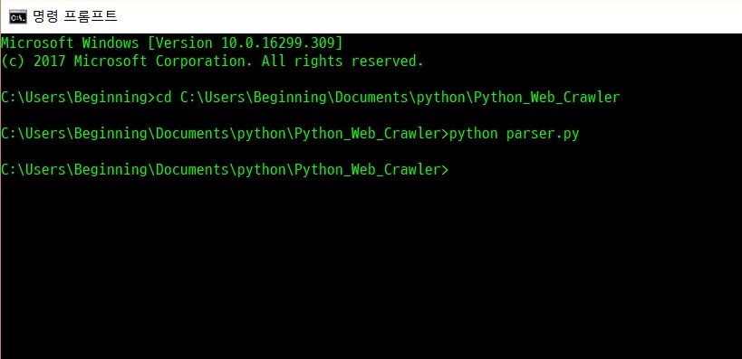
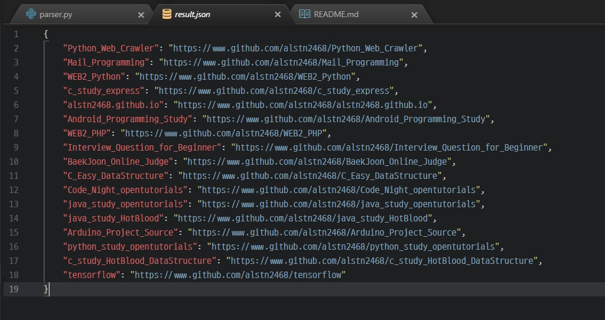

간단한 파이썬 웹 크롤러<br/>
Simple Python Web Crawler
======================
개발자 : 김민수<br/>
Developer : Kim Min Su
---------------------

## 사용법(instructions)

### 1. 깃 클론(Git Clone)
- - -
### 2. 크롤링할 웹 주소 설정(Set URL to Crawling)
- - -
parser.py의 10번째 줄(parser.py, Line 10)
```
request =  requests.get('https://github.com/alstn2468?tab=repositories')
                         ▲     여기에 주소를 설정(Set URL here)      ▲
```
### 3. 크롤링할 웹페이지에서 요소 검사(Scanning for elements in the web)
- - -
parser.py의 20번째 줄(parser.py, Line 20)
```
repo_titles = soup.select('#user-repositories-list > ul > li > div.d-inline-block.mb-1 > h3 > a')
                            ▲                    여기에 CSS 요소를 설정                      ▲
```
### 4. JSON 형식 지정 및 크롤링(Formatting JSON and Crawling)
- - -
```
cmd
cd C:\Users\Beginning\Documents\python\Python_Web_Crawler ◀ parser.py가 있는 경로
python parser.py / python3 parser.py ◀ 버전에 따라 사용
```
### 5. 실행 결과(Result Images)
- - -


### 6. License
- - -
[MIT License](/LICENSE)<br/>
Copyright (c) 2018 Kimminsu
